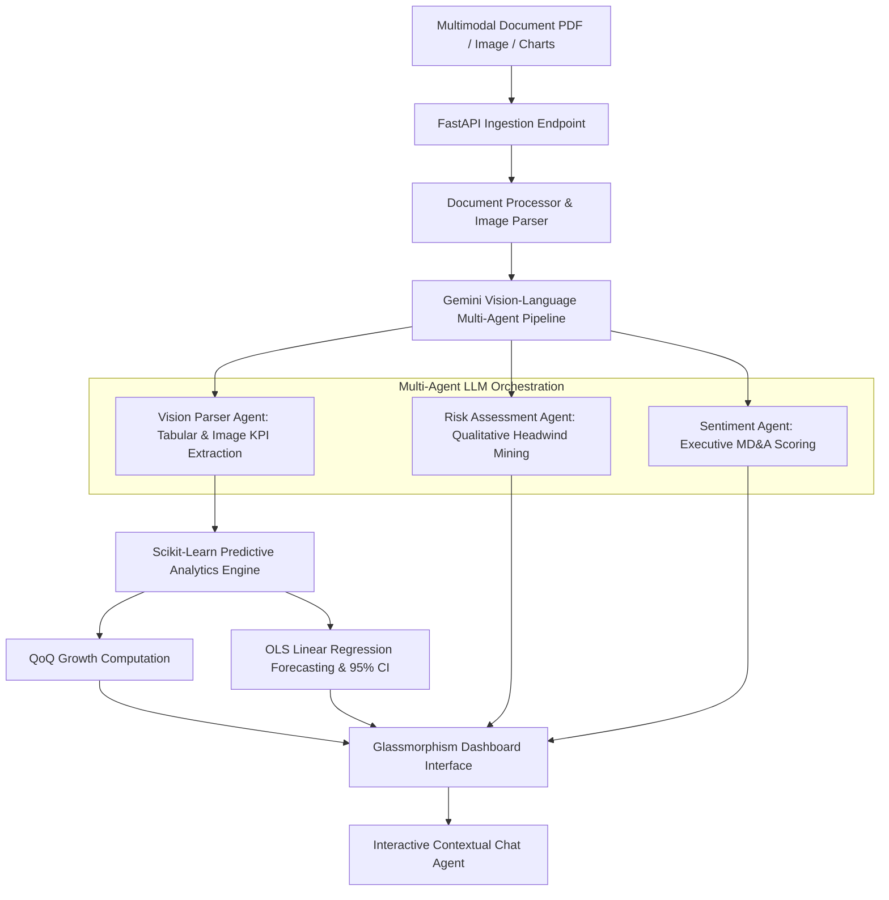

# AlphaDoc-Analytics Platform 📊

An enterprise-grade **Multimodal Generative AI & Financial Analytics Platform** that ingests unstructured financial collateral (PDFs, scanned balance sheets, visual charts, earnings disclosures), extracts key performance indicators (KPIs) using an autonomous **Multi-Agent Architecture**, executes predictive regression modeling, and renders real-time insights on an interactive glassmorphism dashboard.

[](https://www.python.org/)
[](https://fastapi.tiangolo.com/)
[](https://deepmind.google/technologies/gemini/)
[](LICENSE)

---

## 🔍 Key Capabilities & Multimodal Architecture

* **Multimodal Document & Vision Ingestion:** Leverages Gemini Vision-Language Models (VLMs) alongside text extractors to process scanned balance sheets, multi-column tables, visual charts, and embedded infographics with zero OCR data loss.
* **Autonomous Multi-Agent Pipeline:**
  * 👁️ **Multimodal Vision & Parser Agent:** Extracts quantitative metrics, revenue breakdowns, margins, and EPS from tables and images into schema-validated JSON.
  * ⚖️ **Risk & Compliance Agent:** Identifies qualitative market headwinds, supply chain vulnerabilities, and macroeconomic risk factors.
  * 📊 **Sentiment & Executive Intelligence Agent:** Analyzes management discussion & analysis (MD&A) notes to calculate executive sentiment metrics.
* **Predictive Data Science Engine:** Calculates Quarter-over-Quarter (QoQ) metric momentum and fits Ordinary Least Squares (OLS) Linear Regression models (via `Scikit-Learn`) to project revenue and earnings trends with 95% Confidence Intervals.
* **Interactive Glassmorphism UI:** Modern, responsive dashboard engineered with vanilla HTML5, CSS3, and JavaScript featuring dual-axis **Chart.js** visualizers, risk heatmaps, and executive summaries.
* **Contextual Q&A Assistant:** Integrated RAG-inspired chatbot allowing users to query parsed document metrics, risk indicators, and financial trajectories in real time.
* **Formal Academic Paper:** Includes a complete formal research paper titled *"A Multi-Agent Framework for Structured KPI Extraction and Quantitative Trend Forecasting from Unstructured Financial Reports"* (located in `docs/`).

---

## 🏗 System Architecture



---

## 📁 Repository Structure

```text
AlphaDoc-Analytics/
├── backend/
│   ├── pipeline/
│   │   ├── agents.py              # Multi-agent framework definitions
│   │   ├── analytics.py           # OLS Regression & QoQ forecasting engine
│   │   ├── document_processor.py  # Multimodal PDF & text parsing utilities
│   │   └── llm_extractor.py       # Gemini 1.5 VLM extraction pipeline & fallback
│   └── app.py                     # FastAPI backend REST API server
├── docs/
│   └── research_paper.md          # Formal academic research publication
├── frontend/
│   ├── app.js                     # Dashboard interactivity & Chart.js renderer
│   ├── index.html                 # UI document layout & components
│   └── styles.css                 # Dark-mode glassmorphism styling
├── notebooks/
│   └── eda_and_modeling.ipynb     # Jupyter Notebook for EDA & model validation
├── .env                           # Environment configuration
├── requirements.txt               # Backend Python dependency list
└── README.md                      # System documentation
```

---

## 🛠 Setup & Installation

### 1. Clone & Navigate to Repository
```bash
cd AlphaDoc-Analytics
```

### 2. Configure Environment Variables
Create or edit the `.env` file in the root folder:
```env
# Gemini API Key (Optional - triggers high-fidelity fallback simulation if left empty)
GEMINI_API_KEY=your_gemini_api_key_here
PORT=8000
```
*(Note: If no API key is provided, the platform automatically triggers a high-fidelity simulation engine that returns realistic corporate metrics, allowing full visual demonstration of the dashboard without API token costs.)*

### 3. Install Dependencies
```bash
pip install -r requirements.txt
```

### 4. Launch the Backend API Server
```bash
python backend/app.py
```
The interactive FastAPI Swagger documentation will be live at `http://127.0.0.1:8000/docs`.

### 5. Launch the Frontend UI Dashboard
Serve the `frontend/` directory using any HTTP web server, or run:
```bash
python -m http.server 8080 --directory frontend
```
Open `http://localhost:8080` in your web browser.

---

## 📝 Citation & Research

If you utilize this project or multi-agent architecture in academic work, please cite:

```text
Chaudhary, S. (2026). "A Multi-Agent Framework for Structured KPI Extraction and Quantitative Trend Forecasting from Unstructured Financial Reports." docs/research_paper.md
```

## 📄 License
Licensed under the [MIT License](LICENSE).
