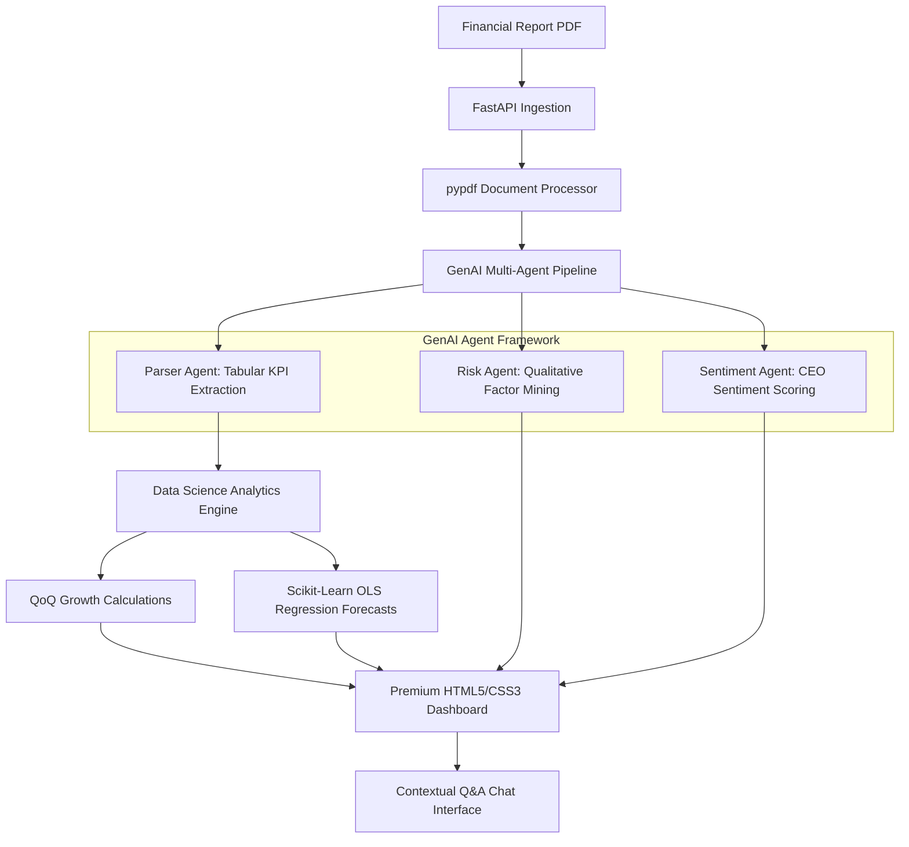

# AlphaDoc-Analytics Platform 📊

An advanced Generative AI and Data Science platform that parses unstructured financial PDF reports, extracts key performance indicators (KPIs) via a multi-agent pipeline, runs statistical predictive models, and renders findings on a premium glassmorphism dashboard.

[](https://www.python.org/)
[](https://fastapi.tiangolo.com/)
[](LICENSE)

---

## 🔍 Overview & Features
* **Multi-Agent Ingestion Pipeline:** Uses isolated Parser, Risk, and Sentiment LLM agents powered by the **Google Gemini API** to structure quantitative and narrative data from raw PDFs.
* **Predictive Data Science Engine:** Computes Quarter-over-Quarter (QoQ) growth and fits Ordinary Least Squares (OLS) Linear Regression models to forecast upcoming revenue and earnings trends with 95% Confidence Intervals.
* **Premium Glassmorphism Dashboard:** Interactive visual layout built with vanilla HTML5, CSS3, and JavaScript. Displays KPI growth trends, risk metrics, and forecasted indicators utilizing dual-axis charts via **Chart.js**.
* **Contextual Chat Agent:** Includes a conversational interface enabling users to query processed reports and trends dynamically.
* **Academic Research Paper:** Includes a complete formal research paper titled *"A Multi-Agent Framework for Structured KPI Extraction and Quantitative Trend Forecasting from Unstructured Financial Reports"* (located in `docs/`).

---

## 🏗 System Architecture



---

## 📁 Repository Structure
```text
AlphaDoc-Analytics/
├── backend/
│   ├── pipeline/
│   │   ├── analytics.py           # Growth & predictive forecasting engine
│   │   ├── document_processor.py  # PDF text extraction utilities
│   │   └── llm_extractor.py       # Gemini API / simulated multi-agent pipeline
│   └── app.py                     # FastAPI server & CORS configurations
├── docs/
│   └── research_paper.md          # Formal academic research publication
├── frontend/
│   ├── app.js                     # Dashboard interaction & Chart.js code
│   ├── index.html                 # HTML5 document layout
│   └── styles.css                 # Custom glassmorphism dark-theme styling
├── notebooks/
│   └── eda_and_modeling.ipynb     # Step-by-step Jupyter Notebook walkthrough
├── .env                           # Local environment configuration file
├── .gitignore                     # Git build exclusions
├── requirements.txt               # Backend Python library requirements
└── README.md                      # General documentation
```

---

## 🛠 Setup & Installation

### 1. Clone & Set Up Directory
```bash
# Navigate to your workspace and enter the project folder
cd AlphaDoc-Analytics
```

### 2. Environment Configuration
Create or modify the `.env` file in the root directory:
```env
# Gemini API Key (optional - if omitted, mock fallback mode is active)
GEMINI_API_KEY=your_gemini_api_key_here
PORT=8000
```
*(Note: If no API key is provided, the platform automatically triggers a high-fidelity simulation engine that returns realistic corporate data, allowing full demonstration of the UI dashboard without API costs.)*

### 3. Install Python Dependencies
```bash
pip install -r requirements.txt
```

### 4. Run the Backend API Server
```bash
python backend/app.py
```
The FastAPI documentation page will be available at `http://127.0.0.1:8000/docs`.

### 5. Launch the Frontend Dashboard
Simply open the `frontend/index.html` file in any modern web browser, or serve it using an HTTP server extension.
To run a local server for the frontend, you can use:
```bash
python -m http.server 8080 --directory frontend
```
Then navigate to `http://localhost:8080` in your browser.

---

## 📝 Research & Citations
To read the full research paper, open [research_paper.md](docs/research_paper.md). If you use this project in an academic or professional capacity, please cite it as:

```text
Chaudhary, S. (2026). "A Multi-Agent Framework for Structured KPI Extraction and Quantitative Trend Forecasting from Unstructured Financial Reports." docs/research_paper.md
```

## 📄 License
This project is licensed under the MIT License - see the LICENSE file for details.
